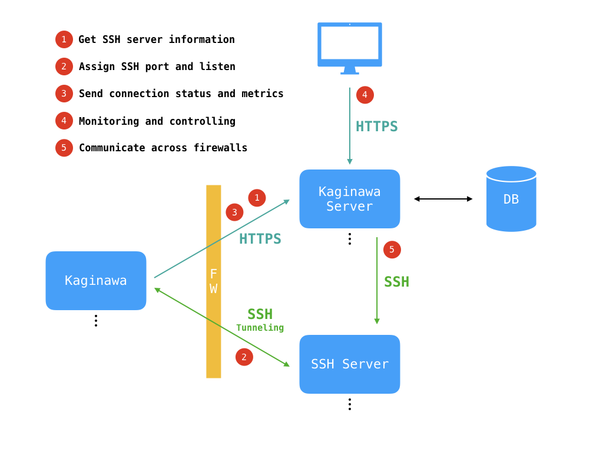

kaginawa
========

[](https://github.com/kaginawa/kaginawa/actions)
[](https://goreportcard.com/report/github.com/kaginawa/kaginawa)

Kaginawa (Japanese: 鉤縄) is a remote maintenance and data collection software designed for IoT gateways.

## Key Features



- SSH tunneling to pass through NATs and firewalls
- Automatic port assignment and reporting
- Device identification using physical MAC address
- Basic metrics collection and alive monitoring
- Scalable and fault tolerant design
- Automatic update

## System Requirements

- [Kaginawa server](https://github.com/kaginawa/kaginawa-server) (data collection)
- SSH Server (ssh sockets)

## Configuration

### Overview

Default configuration file name is `kaginawa.json`.

Minimum configuration:

```json
{
  "api_key": "xxx",
  "server": "xxx.herokuapp.com"
}
```

### Available Parameters

| Parameter              | Type   | Default   | Description                           |
| ---------------------- | ------ | --------- | ------------------------------------- |
| api_key                | string |           | API key issued by Kaginawa Server     |
| server                 | string |           | Address of Kanigawa Server            |
| custom_id              | string |           | User-specified id for your machine    |
| report_interval_min    | int    | 3         | Report upload interval (minutes)      |
| ssh_enabled            | bool   | true      | Enable / disable SSH tunneling        |
| ssh_local_host         | string | localhost | SSH host on your local machine        |
| ssh_local_port         | int    | 22        | SSH port on your local machine        |
| ssh_retry_gap_sec      | int    | 10        | Retry gap of SSH connection (seconds) |
| rtt_enabled            | bool   | true      | Measure round trip time               |
| throughput_enabled     | bool   | false     | Measure network throughput            |
| throughput_kb          | int    | 500       | Data size of throughput measurement   |
| disk_usage_enabled     | bool   | (os deps) | Obtain disk usage                     |
| disk_usage_mount_point | string | /         | Disk usage for mount point            |
| usb_scan_enabled       | bool   | false     | Scan list of USB devices              |
| bt_scan_enabled        | bool   | false     | Scan list of Bluetooth devices        |
| payload_command        | string |           | Payload (additional data) command     |
| update_enabled         | bool   | true      | Enable / disable automatic update     |
| update_check_url       | string | (github)  | Latest version information URL        |
| update_command         | string | (os deps) | Service restart command               |

Sample configuration for payload uploading:

```json
{
  "api_key": "xxx",
  "server": "xxx.herokuapp.com",
  "ssh_enabled": false,
  "payload_command": "curl https://api.ipify.org?format=json"
}
```

### Feature Specific Information

#### Disk Usage

Support status and configuration default values:

| OS      | Supported | Default of `disk_usage_enabled` | Default of `disk_usage_mount_point` |
| ------- | --------- | ------------------------------- | ----------------------------------- |
| Linux   | Yes(*)    | true                            | /                                   |
| MacOS   | Yes       | true                            | /                                   |
| Windows | No        | false                           | (empty)                             |

(*) `df` command is required.

#### USB Devices Information

Support status and configuration default values:

| OS      | Supported | Default of `usb_scan_enabled` |
| ------- | --------- | ----------------------------- |
| Linux   | Yes(*)    | false                         |
| MacOS   | Yes       | false                         |
| Windows | No        | false                         |

(*) `lsusb` command is required.

#### Bluetooth Devices Information

Support status and configuration default values:

| OS      | Supported | Default of `bt_scan_enabled` |
| ------- | --------- | ---------------------------- |
| Linux   | Yes(*)    | false                        |
| MacOS   | Yes       | false                        |
| Windows | No        | false                        |

(*) `hcitool` command is required.

#### Automatic Update

Default values of `update_command` configuration parameter:

Support status and configuration default values:

| OS      | Supported | Default of `update_enabled` | Default of `update_command`     |
| ------- | --------- | --------------------------- | ------------------------------- |
| Linux   | Yes       | true                        | `sudo service kaginawa restart` |
| MacOS   | Yes       | true                        | (empty)                         |
| Windows | Yes       | true                        | (empty)                         |

## Development

### Prerequisites

- Go v1.13 or higher
- (Optional) GNU Make

## Operation

### systemd

Sample unit file is available at [kaginawa.service](kaginawa.service).

Usage:

```
$ wget https://raw.githubusercontent.com/kaginawa/kaginawa/master/kaginawa.service
// review and edit file content
$ mv kaginawa.service /etc/systemd/system/
$ sudo systemctl enable kaginawa
$ sudo service kaginawa start
```

Example user creation and setup operation:

```
$ sudo useradd -d /opt/kaginawa -m kaginawa
$ sudo -su kaginawa
$ cd /opt/kaginawa
$ wget https://kaginawa.github.io/kaginawa.<PLATFORM>.bz2
$ bunzip kaginawa.<PLATFORM>.bz2
$ mv kaginawa.<PLATFORM> kaginawa
$ chmod +x kaginawa
$ vi kaginawa.json
// create configuration file (api_key and server are required)
```

Recommended sudo configuration (`/etc/sudoers` or `/etc/sudoers.d/90-kaginawa`):

```
kaginawa ALL=(ALL) NOPASSWD: /sbin/reboot, /usr/sbin/service
```

### SSH Server

#### User Setup

```
$ sudo useradd -m -s /bin/false kaginawa
$ sudo -su kaginawa
$ ssh-keygen
$ cd ~/.ssh
$ ssh-keygen -f remote
$ cat remote.pub >> authorized_keys
$ chmod 600 authorized_keys
$ cat remote
// Copy private key and paste to kagiana-server's admin screen
```

NOTE: A login shell is not required for tunneling connections.
Use `/bin/false` to reduce the risk of server hijacking.
## License

Kaginawa licensed under the [BSD 3-clause license](LICENSE).

## Author

- [mikan](https://github.com/mikan)
